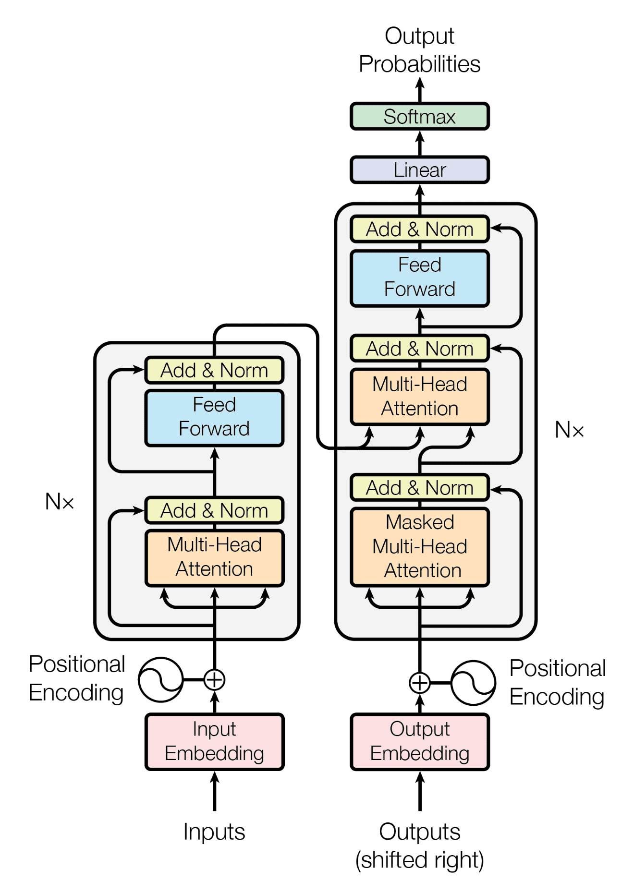
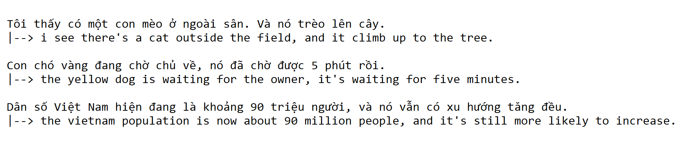

# Machine Translation - Transformer

## Introduction

[Machine Translation](https://en.wikipedia.org/wiki/Machine_translation) is a task that we need to translate a sentence from a language to another language. Particularly, in this repository, I have leveraged the [Transformer model](https://en.wikipedia.org/wiki/Transformer_(machine_learning_model)) to translate from Vietnamese (vi) to English (en).

## Model architecture

Transformer is a very powerful model because of using the self-attention mechanism under the hood. It can improve the weakness of many types of recurrent neural network (RNN). Moreover, the model can be trained much faster since it can feed all the data once only, instead of one-by-one.

<p align="center">
    
</p>
<p align="center">
    <b>Transformer architecture</b>
</p>


## Gallery


<p align="center">
    
</p>
<p align="center">
    <b>Inference examples</b>
</p>

## Usage

### Install libraries

Firstly, please do install all the required libraries:

```bash
cd src
pip install -r requirements.txt
```

Also, because we need to use tokenizer for Vietnames, we will install the model for spacy library:

```bash
pip install https://gitlab.com/trungtv/vi_spacy/-/raw/master/vi_core_news_lg/dist/vi_core_news_lg-0.0.1.tar.gz
```

And the model for English:

```bash
python -m spacy download en_core_web_sm
```

### Train model

To train the model, you can either use the provided script `train.sh`, or use the following command:

```bash
python3 train.py --data_folder "../data" \
    --model_folder "../models"
```

### Inference

In the same way, you can use the `inference.sh` script to run, or:

```bash
python3 inference.py --model_folder "../models" \
    --prompt "Ngày hôm qua, tôi thấy có một con mèo ở ngoài sân. Nó leo lên cây, nhưng nó đã bị té." 
```

## Contribution

The repository is implemented following the instruction of [pbcquoc/transformer](https://github.com/pbcquoc/transformer) and improved by [phuc16102001](https://github.com/phuc16102001/).

## Reference

Thank you very much for a very detail instruction of [pbcquoc](https://github.com/pbcquoc) and the [pretrained tokenizer](https://gitlab.com/trungtv/vi_spacy/) of [trungtv](https://gitlab.com/trungtv).

## License
[MIT](LICENSE)